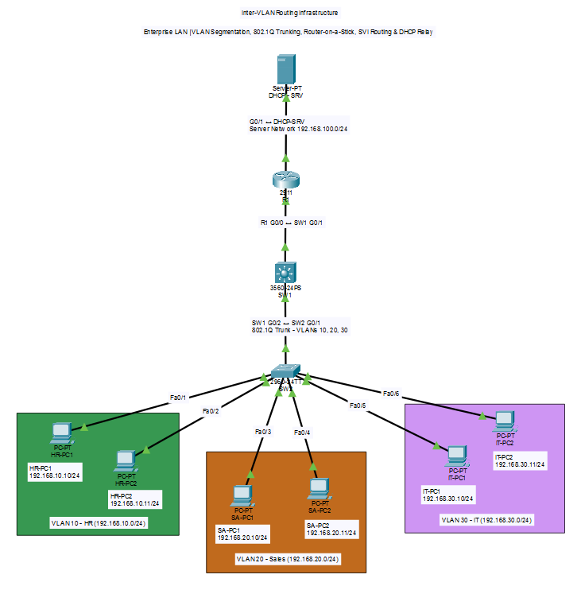

# VLAN-Based Office Network

Production-style Cisco Packet Tracer lab demonstrating VLAN segmentation, IEEE 802.1Q trunking, Router-on-a-Stick (ROAS), Inter-VLAN Routing, centralized DHCP, DHCP relay, and dedicated server-network connectivity for a small enterprise office environment.

This project simulates a real-world enterprise LAN while following documentation, configuration management, validation, troubleshooting, and repository standards commonly used in professional network engineering.

---

## Project Summary

| Category          | Information                                                                                            |
| ----------------- | ------------------------------------------------------------------------------------------------------ |
| **Vendor**        | Cisco                                                                                                  |
| **Project Type**  | Enterprise LAN                                                                                         |
| **Difficulty**    | ⭐ Beginner                                                                                         |
| **Lab Platform**  | Cisco Packet Tracer 9.0.1                                                                              |
| **Technologies**  | VLAN, IEEE 802.1Q Trunking, Router-on-a-Stick (ROAS), Inter-VLAN Routing, Centralized DHCP, DHCP Relay |
| **Documentation** | Included                                                                                               |

---

## Network Devices

| Device      | Model               | Quantity |
| ----------- | ------------------- | -------: |
| Router      | Cisco 2911          |        1 |
| Switch      | Cisco Catalyst 2960 |        2 |
| DHCP Server | Generic Server      |        1 |
| End Devices | Generic PC          |        6 |

---

## Network Architecture

The network is divided into separate departmental VLANs to provide logical segmentation and reduce the size of individual broadcast domains.

| VLAN           | Department  | Network            | Default Gateway |
| -------------- | ----------- | ------------------ | --------------- |
| VLAN 10        | HR          | `192.168.10.0/24`  | `192.168.10.1`  |
| VLAN 20        | Sales       | `192.168.20.0/24`  | `192.168.20.1`  |
| VLAN 30        | IT          | `192.168.30.0/24`  | `192.168.30.1`  |
| Server Network | DHCP Server | `192.168.100.0/24` | `192.168.100.1` |

The Cisco 2911 router provides:

* Inter-VLAN Routing
* Default gateway services for VLAN 10, VLAN 20, and VLAN 30
* Layer 3 connectivity to the dedicated server network
* DHCP relay functionality

The centralized DHCP server operates on the separate `192.168.100.0/24` network.

DHCP requests from the departmental VLANs are forwarded to the centralized DHCP server using:

```cisco
ip helper-address 192.168.100.10
```

---

## Project Overview

This project demonstrates how to design and deploy a segmented enterprise office network using Virtual LANs (VLANs), multiple Layer 2 switches, Router-on-a-Stick, and centralized DHCP services.

Three departments are separated into independent broadcast domains:

```text
VLAN 10 → HR
VLAN 20 → Sales
VLAN 30 → IT
```

A dedicated server network is used for centralized infrastructure services:

```text
192.168.100.0/24
```

The router performs Layer 3 forwarding between the departmental VLANs and the server network.

The project demonstrates the following traffic flow:

```text
Client
   ↓
Access Port
   ↓
Department VLAN
   ↓
802.1Q Trunk
   ↓
R1 Router-on-a-Stick
   ↓
Inter-VLAN Routing
   ↓
Destination VLAN / Server Network
```

For DHCP specifically:

```text
DHCP Client
     ↓
Department VLAN
     ↓
R1
     │
     │ ip helper-address
     ↓
DHCP Server
192.168.100.10
```

---

## Network Topology

The complete topology is available in the **topology** directory.



### Topology Files

* **topology.drawio** — Editable Draw.io source file
* **network-topology.png** — Exported network topology diagram

---

## Repository Goal

This repository serves as a reusable reference for learning, practicing, and demonstrating enterprise networking concepts using Cisco Packet Tracer.

The project is designed to demonstrate not only device configuration, but also:

* Network architecture
* IP addressing
* Implementation methodology
* Centralized services
* Troubleshooting
* Validation
* Configuration management
* Technical documentation

It is intended for networking students, networking enthusiasts, junior network engineers, and engineers preparing for enterprise infrastructure roles.

---

## Objectives

* Design a small enterprise office network
* Segment departments using VLANs
* Configure Cisco switch access ports
* Configure IEEE 802.1Q trunk links
* Implement Router-on-a-Stick (ROAS)
* Enable Inter-VLAN Routing
* Create a dedicated server network
* Deploy centralized DHCP services
* Configure DHCP relay using `ip helper-address`
* Verify DHCP address assignment
* Verify default gateway connectivity
* Validate Inter-VLAN communication
* Validate server-network connectivity
* Document the complete implementation
* Troubleshoot common Layer 2 and Layer 3 issues

---

## Technologies Used

* Cisco Packet Tracer
* Cisco IOS CLI
* VLAN
* IEEE 802.1Q Trunking
* Access Ports
* Router-on-a-Stick (ROAS)
* Inter-VLAN Routing
* Centralized DHCP
* DHCP Relay
* IP Addressing and Subnetting
* ICMP Connectivity Testing
* Layer 2 / Layer 3 Troubleshooting

---

## Requirements

To reproduce this project, you will need:

* Cisco Packet Tracer 9.0.1 or compatible version
* Basic knowledge of Cisco IOS CLI
* Basic understanding of VLANs and IP addressing
* Windows, Linux, or macOS

The complete software and hardware environment is documented in:

**[LAB-ENVIRONMENT.md](LAB-ENVIRONMENT.md)**

---

## Skills Demonstrated

* Enterprise Network Design
* Layer 2 Switching
* VLAN Segmentation
* Access Port Configuration
* IEEE 802.1Q Trunk Configuration
* Router-on-a-Stick (ROAS)
* Inter-VLAN Routing
* IP Address Planning
* Centralized DHCP Deployment
* DHCP Relay Configuration
* Server Network Design
* Network Validation
* Layer 2 / Layer 3 Troubleshooting
* Cisco IOS CLI
* Configuration Management
* Technical Documentation

---

## Repository Structure

```text
VLAN-Based-Office-Network/
│
├── docs/
│   ├── architecture.md
│   ├── implementation.md
│   ├── ip-addressing.md
│   ├── troubleshooting.md
│   └── validation.md
│
├── topology/
│   ├── topology.drawio
│   └── network-topology.png
│
├── lab/
│   └── vlan-based-office-network.pkt
│
├── configs/
│   ├── R1.cfg
│   ├── SW1.cfg
│   └── SW2.cfg
│
├── images/
│
├── LAB-ENVIRONMENT.md
├── README.md
├── LICENSE
└── .gitignore
```

---

## Documentation

| Document                                             | Description                                              |
| ---------------------------------------------------- | -------------------------------------------------------- |
| [`docs/architecture.md`](docs/architecture.md)       | Network architecture and design                          |
| [`docs/implementation.md`](docs/implementation.md)   | Step-by-step implementation guide                        |
| [`docs/ip-addressing.md`](docs/ip-addressing.md)     | IP addressing and VLAN allocation plan                   |
| [`docs/validation.md`](docs/validation.md)           | Network validation and testing results                   |
| [`docs/troubleshooting.md`](docs/troubleshooting.md) | Troubleshooting procedures and findings                  |
| [`LAB-ENVIRONMENT.md`](LAB-ENVIRONMENT.md)           | Software versions, device inventory, and lab environment |

---

## Lab Environment

The complete lab environment, including:

* Operating system
* Host machine
* Cisco Packet Tracer version
* Device inventory
* Verification commands
* Compatibility information

is documented in:

**[LAB-ENVIRONMENT.md](LAB-ENVIRONMENT.md)**

---

## Lab Files

The **lab** directory contains the Cisco Packet Tracer project used to build and validate this implementation.

### Packet Tracer Project

```text
lab/vlan-based-office-network.pkt
```

The Packet Tracer project contains the complete simulated network topology and device configuration.

---

## Device Configurations

The **configs** directory contains the saved configurations of the configured network devices.

```text
configs/
├── R1.cfg
├── SW1.cfg
└── SW2.cfg
```

These configuration files provide a reproducible reference for:

* Router-on-a-Stick configuration
* VLAN configuration
* Access-port configuration
* Trunk configuration
* Router subinterfaces
* DHCP relay configuration
* IP addressing

---

## Validation

The implementation was successfully validated using Cisco IOS verification commands, client-side IP inspection, and end-to-end connectivity testing.

### Completed Validation

* VLAN Verification
* Access-Port Verification
* 802.1Q Trunk Verification
* Router Interface Verification
* Router Subinterface Verification
* DHCP Address Assignment
* DHCP Relay Verification
* Default Gateway Connectivity
* Inter-VLAN Connectivity
* Department-to-Server Connectivity
* Running Configuration Verification
* End-to-End Connectivity Testing

### Example Connectivity Tests

```text
HR-PC1 → HR Gateway
HR-PC1 → Sales-PC1
HR-PC1 → IT-PC1
HR-PC1 → DHCP Server

SA-PC1 → Sales Gateway
SA-PC1 → HR-PC1
SA-PC1 → IT-PC1
SA-PC1 → DHCP Server

IT-PC1 → IT Gateway
IT-PC1 → HR-PC1
IT-PC1 → Sales-PC1
IT-PC1 → DHCP Server
```

Validation evidence and detailed test results are documented in:

**[`docs/validation.md`](docs/validation.md)**

---

## Troubleshooting

The implementation process included troubleshooting and verification of:

* Trunk operational state
* Router interface state
* Router-to-server connectivity
* DHCP relay configuration
* Client IP addressing
* Inter-VLAN connectivity
* Initial ICMP packet loss
* Packet Tracer command-line limitations

The troubleshooting methodology followed a structured approach:

```text
Layer 1
   ↓
Layer 2
   ↓
Layer 3
   ↓
DHCP / Services
   ↓
End-to-End Connectivity
```

Detailed troubleshooting records are available in:

**[`docs/troubleshooting.md`](docs/troubleshooting.md)**

---

## Learning Outcomes

After completing this project, you should understand how to:

* Design a VLAN-based enterprise office network
* Create logical network segmentation using VLANs
* Configure Cisco switch access ports
* Configure IEEE 802.1Q trunk links
* Understand VLAN traffic across trunk links
* Implement Router-on-a-Stick
* Configure router subinterfaces
* Implement Inter-VLAN Routing
* Design a separate server network
* Deploy centralized DHCP
* Configure DHCP relay using `ip helper-address`
* Verify Cisco IOS configurations
* Test Layer 2 and Layer 3 connectivity
* Troubleshoot common enterprise LAN issues
* Document a network implementation professionally

---

## Future Improvements

The current implementation provides the foundation for additional enterprise networking capabilities.

### Network Security

* Access Control Lists (ACLs)
* Port Security
* DHCP Snooping
* Dynamic ARP Inspection
* IP Source Guard
* 802.1X Authentication
* SSH Remote Management

### Layer 2 Improvements

* Rapid PVST+
* EtherChannel
* Root Bridge Optimization
* VLAN Pruning
* Storm Control

### Routing and Redundancy

* Static Routing
* OSPF
* EIGRP
* HSRP
* Multiple routers
* Redundant uplinks

### Infrastructure Services

* DNS
* NTP
* Syslog
* SNMP
* Network Monitoring
* Centralized Logging

### Network Automation

* Python
* Netmiko
* NAPALM
* Ansible
* REST APIs
* Automated Configuration Backup

These enhancements can evolve the current lab from a small enterprise LAN into a more complete enterprise infrastructure environment.

---

## License

This project is licensed under the **MIT License**.

See the **LICENSE** file for details.
